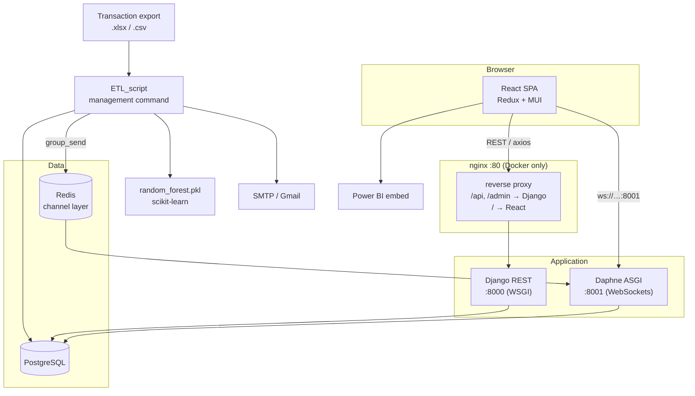

<p align="center">
  <picture>
    <source media="(prefers-color-scheme: dark)" srcset="kashif-logo-dark.png">
    
  </picture>
</p>

<h1 align="center">Kashif</h1>

<p align="center"><em>Transaction fraud intelligence for card payment streams.</em></p>

<p align="center">
  
  
  
  
  
  
  
  
  
  
  
  
  
  
  
  
</p>

A full-stack system that ingests bank card-transaction exports, scores each transaction with a
trained Random Forest classifier, flags non-compliant transactions, and streams alerts to a
live operator dashboard.

Built as an internship project for Attijari Bank.

---

## Table of contents

- [What it does](#what-it-does)
- [Architecture](#architecture)
- [Technology stack](#technology-stack)
- [Project structure](#project-structure)
- [Prerequisites](#prerequisites)
- [Installation](#installation)
- [Configuration](#configuration)
- [The model file](#the-model-file-required)
- [Running locally](#running-locally)
- [Running the ETL pipeline](#running-the-etl-pipeline)
- [API reference](#api-reference)
- [Testing](#testing)
- [Build](#build)
- [Deployment](#deployment)
- [Environment separation](#environment-separation)
- [Known issues](#known-issues)
- [Troubleshooting](#troubleshooting)

---

## What it does

1. **Ingest** — a Django management command reads a transaction export (`.xlsx` or `.csv`),
   converting Excel to CSV on the fly.
2. **Score** — each row is label-encoded and normalized into the exact 10-feature vector the
   model was trained on, then classified by a Random Forest loaded from `random_forest.pkl`.
3. **Persist** — the transaction is written to Postgres along with a `ModelPerformance` record.
4. **Alert** — non-compliant transactions create an `Alert` row and send an email to the operator.
5. **Stream** — every transaction and alert is broadcast over WebSockets (Django Channels) to a
   React dashboard that updates live, without polling.
6. **Review** — operators browse and filter transactions, comment on them, and rate the model's
   predictions. A Power BI report is embedded for deeper analytics.

> **Note on naming.** This field used to be called `IS_COMPLIANT`, whose name asserted the
> opposite of its value. It is now **`IS_FRAUDULENT`** — `True` means the transaction was
> classified as fraudulent. Migration `transactions/0005` performs a pure `RenameField`, so
> existing rows keep their values. The source CSV column is still named `IS_COMPLIANT`; only the
> model field changed.

---

## Architecture



**Key architectural facts, verified against the code:**

- **The prediction path is a management command, not an HTTP endpoint.** Nothing in
  `prediction/views.py` runs the model. All scoring happens in
  `transactions/management/commands/ETL_script.py`.
- **REST and WebSockets are two separate processes on two separate ports.** The React client
  hardcodes `ws://localhost:8001` (`src/WebSocketContext.js:35-38`) while REST goes to `:8000`.
  You must run *both* `runserver` and `daphne` locally.
- **Redis is mandatory for realtime.** `CHANNEL_LAYERS` uses `channels_redis.core.RedisChannelLayer`
  at `127.0.0.1:6379`. Without Redis every broadcast fails silently and the dashboard stays empty.
- **Four WebSocket groups** are combined into one router in `mainapp/asgi.py`:

  | Path | Consumer | Group |
  |---|---|---|
  | `ws/transactions/` | `transactions.consumers.TransactionConsumer` | `transactions` |
  | `ws/alerts/` | `alerts.consumers.AlertConsumer` | `alerts` |
  | `ws/user-activity/` | `users.consumers.UserActivityConsumer` | `user-activity` |
  | `ws/ratings/` | `prediction.consumers.RatingConsumer` | `ratings` |

---

## Technology stack

| Layer | Technology | Version |
|---|---|---|
| Backend framework | Django | 5.1 |
| REST API | Django REST Framework | 3.15.2 |
| Realtime | Django Channels + channels-redis + Daphne | 4.1.0 / 4.2.0 / 2.5.0 |
| Authentication | DRF `TokenAuthentication` + `dj-rest-auth` | 7.2.0 |
| Filtering | django-filter | 24.3 |
| Database | PostgreSQL | 12 (Docker image `postgres:12.0-alpine`) |
| Channel layer | Redis | 6379 |
| ML | scikit-learn + joblib + pandas + numpy | 1.5.1 / 1.4.2 / 2.2.2 / 2.0.1 |
| WSGI / static server | gunicorn / `serve` | 22.0.0 |
| Frontend | React (Create React App) | 18.3.1 / react-scripts 5.0.1 |
| State | Redux + redux-thunk | 5.0.1 / 3.1.0 |
| UI | MUI, Bootstrap, reactstrap, rsuite | — |
| Charts | ApexCharts, react-gauge-chart | — |
| Analytics | Power BI embed (`powerbi-client-react`) | 1.4.0 |
| Email | SMTP (Gmail) | — |
| Reverse proxy | nginx | — |
| Orchestration | Docker Compose | — |
| CI/CD | *none configured* | — |

There is **no** CI pipeline, and no Azure/Terraform/Kubernetes configuration in this repository.

---

## Project structure

Everything lives at the repository root. The data-science artifacts that produced the model sit
alongside the application they feed.

```text
.
├── fraud-detection.ipynb            # EDA + Random Forest training → random_forest.pkl
│                                    (outputs stripped; keep them stripped)
├── 2024-08-12 Extraction_*.xlsx     # Raw transaction export (git-ignored, see Configuration)
├── Rapport_stage__Attijari_.pdf     # Internship report (git-ignored)
├── kashif-logo.png                  # wordmark, light theme (used by this README)
├── kashif-logo-dark.png             # wordmark, dark theme (GitHub picks per theme)
├── docker-compose.yml               # django + daphne + db + redis + react + nginx
├── requirements.txt                 # Local/dev Python deps (superset of backend/)
├── .env.example                     # ENV_API_SERVER (compose build arg)
├── LICENSE                          # MIT
├── CLAUDE.md                        # Guidance for AI coding assistants
├── docs/
│   └── AUDIT.md                     # Full repository audit: defects, ambiguities, decisions
│
├── backend/
│   ├── Dockerfile                   # python:3.12-slim-bookworm
│   ├── entrypoint.sh                # waits for PG, collectstatic, migrate, recreate superuser
│   ├── requirements.txt             # Deps installed into the Docker image
│   ├── .env.example
│   └── djangoapp/
│       ├── manage.py
│       ├── mainapp/                 # settings, local_settings, test_settings, urls, asgi, wsgi
│       ├── models/README.md         # where random_forest.pkl goes (the .pkl is git-ignored)
│       ├── transactions/            # Transaction model, REST API, ETL commands, WS consumer
│       ├── prediction/              # ModelPerformance, ModelRating, WS consumer
│       ├── alerts/                  # Alert model + WS consumer
│       ├── comments/                # Operator comments
│       └── users/                   # auth, UserActivity audit log, signals
│
├── frontend/
│   ├── Dockerfile                   # node:20-alpine
│   └── react_app/
│       ├── .env.example
│       └── src/
│           ├── Urls.js              # all routes
│           ├── settings.js          # API + WebSocket base URL resolution
│           ├── settings.test.js
│           ├── WebSocketContext.js  # 4 sockets, capped + mirrored to localStorage
│           ├── store/               # one Redux slice per domain
│           ├── views/               # pages
│           ├── components/dashboard/
│           └── Layouts/
│
├── nginx/nginx.conf                 # /api + /admin → django, /ws/ → daphne, / → react
├── postgres/.env.example
└── localPythonEnv/                  # Legacy virtualenv (git-ignored, do not use — see below)
```

---

## Prerequisites

| Tool | Version | Notes |
|---|---|---|
| Python | **3.10+** (3.12 recommended) | Django 5.1 requires ≥ 3.10 |
| Node.js | **20** | Matches the Docker image (`node:20-alpine`) |
| PostgreSQL | 12+ | Or use the Docker `db` service |
| Redis | 6+ | **Required** for WebSockets |
| Docker + Compose | any recent | Optional, for the container stack |

> ⚠️ **Do not use the bundled `localPythonEnv/`.** It is a committed virtualenv whose interpreter
> points at `C:\Users\hamdi\AppData\Local\Programs\Python\Python312\python.exe`, a path that does
> not exist on any other machine. Running it fails with `No Python at ...`. It is now git-ignored;
> create a fresh venv as shown below.

---

## Installation

```bash
git clone https://github.com/KHSIB-Hamdi/kashif.git
cd kashif
```

### Backend

```bash
# all paths below are relative to the repository root

python -m venv .venv
# Windows
.venv\Scripts\activate
# macOS/Linux
source .venv/bin/activate

pip install -r requirements.txt
```

No post-install patching is required. (Historically it was: `django-rest-auth==0.9.5` could not
import under Django 5.1, and the project only ran because the bundled virtualenv contained a
hand-patched copy. That dependency has been replaced with the maintained `dj-rest-auth`, so a
clean install now starts as-is.)

### Frontend

```bash
cd frontend/react_app
npm install
```

---

## Configuration

Copy each `.env.example` to `.env` and fill in real values. **No `.env` file is tracked by Git.**

```bash
cp backend/.env.example            backend/.env
cp postgres/.env.example           postgres/.env
cp .env.example                    .env
cp frontend/react_app/.env.example frontend/react_app/.env
```

### Backend — `backend/.env`

| Variable | Read at | Required | Purpose |
|---|---|---|---|
| `DJANGO_ENV` | `mainapp/local_settings.py:8` | yes | `development`/`production` read the vars below; any other value uses hardcoded local defaults |
| `DEBUG` | `local_settings.py:20` | yes | `0` or `1` |
| `SECRET_KEY` | `local_settings.py:15` | yes | Django signing key |
| `DJANGO_ALLOWED_HOSTS` | `local_settings.py:25` | yes | space-separated |
| `DJANGO_ADMIN_USER` / `_EMAIL` / `_PASSWORD` | `backend/entrypoint.sh` | Docker only | superuser recreated on **every** container start |
| `DATABASE` | `entrypoint.sh:2` | Docker only | set to `postgres` to make the entrypoint wait for the DB |
| `DB_ENGINE` / `DB_DATABASE` / `DB_USER` / `DB_PASSWORD` / `DB_HOST` / `DB_PORT` | `local_settings.py:29-40` | yes | must match `postgres/.env` |
| `EMAIL_HOST_USER` | `mainapp/settings.py:166` | for alerts | SMTP account |
| `EMAIL_HOST_PASSWORD` | `settings.py:167` | for alerts | Gmail **App Password**, not the account password |
| `DEFAULT_FROM_EMAIL` | `settings.py:170` | for alerts | alert sender; defaults to `EMAIL_HOST_USER` |

### Database — `postgres/.env`

`POSTGRES_USER`, `POSTGRES_PASSWORD`, `POSTGRES_DB` — consumed by the `db` service. Must match the
`DB_*` values above.

### Compose — `.env`

`ENV_API_SERVER` — passed as the `API_SERVER` build arg to the React image and baked in as
`REACT_APP_API_SERVER`. This must be the URL the **browser** uses, not an internal container name.

### Frontend — `frontend/react_app/.env`

| Variable | Read at | Purpose |
|---|---|---|
| `REACT_APP_API_SERVER` | `src/settings.js:8` | Backend base URL. **Production branch only** — development hardcodes `http://localhost:8000` |
| `REACT_APP_POWERBI_REPORT_ID` | `src/views/analytics/PowerBI.js` | Power BI report GUID |
| `REACT_APP_POWERBI_EMBED_URL` | `src/views/analytics/PowerBI.js` | Power BI embed URL |
| `REACT_APP_POWERBI_ACCESS_TOKEN` | `src/views/analytics/PowerBI.js` | Short-lived AAD token |

> ⚠️ Every `REACT_APP_*` value is compiled into the JavaScript bundle and is visible to anyone who
> loads the page. Never put a long-lived secret here. The Power BI access token in particular
> expires within an hour and must be re-minted; the correct fix is a backend endpoint that issues
> embed tokens on demand (see [Known issues](#known-issues)).

### Data files

The transaction export (`*.xlsx`), the internship report, and **the training notebook** are
**git-ignored** because they contain real bank data — the notebook's saved cell outputs embed
actual transaction rows. To track the notebook, strip its outputs first
(`pip install nbstripout && nbstripout fraud-detection.ipynb`) and remove its rule from
`.gitignore`.

The transaction export and the report They are not distributed with the repository — obtain them separately and
place them wherever convenient, then pass the path to the ETL command.

---

## The model file (required)

`random_forest.pkl` **is not in this repository**, and the ETL commands load it from a hardcoded
absolute path that will not exist on your machine:

```python
# transactions/management/commands/ETL_script.py:163
rf_model = joblib.load(r"C:\Users\hamdi\Documents\random_forest.pkl")
```

To obtain it, run `fraud-detection.ipynb` (the training notebook at the repository root); its final
cell writes the model:

```python
save_model(trained_model, "/kaggle/working/random_forest.pkl")
```

The notebook was authored on Kaggle and reads
`/kaggle/input/transactions-data/transaction_data.csv`, so its paths need adjusting to run locally.

**Until you place the file and correct the path in both `ETL_script.py` and
`import_transactions.py`, the prediction pipeline cannot run.** Making the path configurable is
tracked in [`docs/AUDIT.md`](docs/AUDIT.md) as a pending decision.

---

## Running locally

You need **four** processes. Start Redis and Postgres first.

```bash
# 1. Redis (channel layer) — must be on 127.0.0.1:6379
redis-server

# 2. Postgres — native, or just the Docker service:
docker compose up -d db
```

```bash
# 3. Django REST API on :8000
cd backend/djangoapp
python manage.py migrate
python manage.py createsuperuser
python manage.py runserver
```

```bash
# 4. Daphne ASGI server on :8001 — REQUIRED for the live dashboard
cd backend/djangoapp
daphne -p 8001 mainapp.asgi:application
```

```bash
# 5. React dev server on :3000
cd frontend/react_app
npm start
```

Open <http://localhost:3000>. Log in with the superuser you created.

Port `8001` is not configurable from the frontend — it is hardcoded in
`src/WebSocketContext.js:35-38`. If you change it, change it there too.

---

## Running the ETL pipeline

Two commands exist. They are near-duplicates; prefer the first.

```bash
cd backend/djangoapp

# Streaming: reads one row at a time, predicts, saves, broadcasts, sleeps 0.5s.
# Best for demoing the live dashboard.
python manage.py ETL_script "/path/to/Extraction.xlsx"

# Two-phase (older): bulk-inserts every row with PROCESSED=False,
# then loops in batches of 50 classifying them.
python manage.py import_transactions "/path/to/Extraction.xlsx"
```

Both accept `.xlsx` (converted to `.csv` beside the source file) or `.csv` directly. The CSV must
contain: `REF_UNIQUE`, `DEV_CPTE`, `PRODUIT`, `DATE_TRX` (format `%m/%d/%Y %H:%M`),
`NUM_AUTORISATION`, `MONTANT_TRX`, `CHAPITRE`, `LIB_CPTE`, `UTILISATION`, `EMPLACEMENT`,
`TERRITOIRE`.

---

## API reference

All endpoints are under `/api/`. Authentication is DRF token-based
(`Authorization: Token <token>`).

| Method | Endpoint | Purpose |
|---|---|---|
| POST | `/api/auth/login/` | obtain a token |
| POST | `/api/auth/logout/` | invalidate a token |
| POST | `/api/auth/update_password/` | change password |
| GET/POST | `/api/auth/users/` | list / create users |
| GET | `/api/auth/users/all/` | list all users |
| PATCH | `/api/auth/users/update/<pk>/` | update a user |
| DELETE | `/api/auth/users/delete/<pk>/` | delete a user |
| GET | `/api/auth/users/detail/` | current authenticated user |
| GET | `/api/auth/user-activities/` | last 10 login/logout events |
| GET | `/api/transactions` | paginated, filterable list (20/page) |
| POST | `/api/transactions/create` | create |
| GET | `/api/transactions/<pk>/details/` | one transaction + its model performances |
| PATCH | `/api/transactions/update/<pk>/` | update |
| DELETE | `/api/transactions/delete/<pk>/` | delete |
| GET | `/api/transactions/distinct/<field>/` | distinct values — `PRODUIT`, `DEV_CPTE`, `LIB_CPTE`, `TERRITOIRE` only |
| GET | `/api/alerts/` | 10 most recent alerts |
| POST | `/api/model-rating/<model_performance_id>/` | rate a prediction |
| GET/POST | `/api/comments/` | list (first 10) / create |
| GET | `/api/comments/<pk>/` | retrieve |
| PATCH | `/api/comments/update/<pk>/` | update |
| DELETE | `/api/comments/delete/<pk>/` | delete |

Transaction list filters (exact match, via django-filter): `PRODUIT`, `DEV_CPTE`, `LIB_CPTE`,
`MONTANT_TRX`, `UTILISATION`, `EMPLACEMENT`, `TERRITOIRE`, `DATE_TRX`. Pagination: `?page=`,
`?page_size=` (max 1000).

---

## Testing

The backend has a real suite; the frontend has focused unit tests.

```bash
# Backend -- 17 tests. Uses in-memory SQLite and an in-memory channel layer,
# so it needs neither PostgreSQL nor Redis.
cd backend/djangoapp
python manage.py test --settings=mainapp.test_settings

# A single test class or method:
python manage.py test transactions.tests.TransactionAPITests --settings=mainapp.test_settings
python manage.py test users.tests.AuthEndpointTests.test_login_returns_a_token --settings=mainapp.test_settings
```

```bash
# Frontend -- 6 tests
cd frontend/react_app
npm test -- --watchAll=false

# One file:
npm test -- --watchAll=false settings
```

What the tests actually guard:

| Suite | Covers |
|---|---|
| `transactions/tests.py` | The `IS_FRAUDULENT` rename and its serialization, list pagination, `django-filter` filtering, transaction detail + 404, the distinct-values allow-list, and `204` on delete |
| `users/tests.py` | The `dj-rest-auth` migration: token login, bad-credential rejection, auth-required endpoints, the current-user endpoint, and that login writes a `UserActivity` row via Django's signal |
| `src/settings.test.js` | API/WebSocket URL resolution across `development`/`production`, including the same-origin `ws://`/`wss://` derivation used behind nginx |

`mainapp/test_settings.py` overrides the database, channel layer, email backend and password
hasher for speed and isolation.

There is no separate integration or end-to-end suite, and no linter or type checker beyond the
ESLint rules CRA applies during `npm run build`.

## Build

```bash
cd frontend/react_app
npm run build          # → build/, ~484 kB gzipped main bundle
```

The build succeeds with pre-existing ESLint warnings (unused variables, a missing hook dependency,
one `==` comparison). The backend is not "built"; `collectstatic` runs from `entrypoint.sh` inside
Docker.

---

## Deployment

The only deployment configuration in the repository is Docker Compose:

```bash
docker compose up --build
```

This starts four services:

| Service | Image / build | Port | Command |
|---|---|---|---|
| `nginx` | `./nginx` | **80** (published) | reverse proxy |
| `react` | `./frontend` | 3000 (internal) | `serve -s build -l 3000` |
| `django` | `./backend` | 8000 (internal) | `gunicorn mainapp.wsgi:application` |
| `daphne` | `./backend` | 8001 (internal) | `daphne -b 0.0.0.0 -p 8001 mainapp.asgi:application` |
| `db` | `postgres:12.0-alpine` | 5432 (internal) | — |
| `redis` | `redis:7-alpine` | 6379 (internal) | channel layer |

nginx routes `/admin` and `/api` to Django (gunicorn), **`/ws/` to Daphne** with the HTTP/1.1
`Upgrade` headers WebSockets require, `/static/admin/` and `/static/rest_framework/` to the Django
static volume, and everything else to the React app.

`backend/entrypoint.sh` waits for Postgres, runs `collectstatic` and `migrate`, then **deletes and
recreates** the superuser identified by `DJANGO_ADMIN_EMAIL` on every start.

Both images build against the pinned dependencies (Python 3.12 / Node 20), and the stack now
includes the `redis` and `daphne` services the realtime feature needs. `ENV_API_SERVER` in
`.env` must be the URL the **browser** uses — it is baked into the JS bundle at
build time.

---

## Environment separation

Only two environments exist. Do not assume more.

| Environment | How it is selected | Database | Notes |
|---|---|---|---|
| **Local / development** | `DJANGO_ENV` unset or any value other than `development`/`production` | hardcoded local Postgres in `local_settings.py:45-53` | `DEBUG=True`, `CORS_ORIGIN_ALLOW_ALL=True` |
| **Docker ("production")** | `DJANGO_ENV=production` in `backend/.env` | from `DB_*` env vars | still sets `CORS_ORIGIN_ALLOW_ALL = True` |

There is **no** staging environment and **no** test environment. `CORS_ORIGIN_ALLOW_ALL = True` is
applied unconditionally in `local_settings.py:62`, including in the production path — this should
be restricted before any real deployment.

---

## Known issues

Remaining verified defects, documented rather than silently patched. Full detail and the decisions
each one needs are in [`docs/AUDIT.md`](docs/AUDIT.md).

| # | Issue | Impact |
|---|---|---|
| 1 | `random_forest.pkl` is not distributed with the repository | ETL/prediction cannot run until you build it from the notebook — see [The model file](#the-model-file-required). The path is now configurable via `FRAUD_MODEL_PATH`. |
| 2 | `save_model_performance()` scores each row against itself | Accuracy is always 1.0; precision/recall/F1 are meaningless. Fixing this needs labelled ground truth the pipeline does not have. |
| 3 | `POST /api/predict` does not exist | The "Select a model" page (`/select-model`) cannot work; only the Random Forest ETL path is implemented. XGBoost and KNN were never built. |
| 4 | Power BI access token is shipped in the JS bundle | It is now an environment variable rather than hardcoded, but `REACT_APP_*` values are public. A backend token endpoint is the real fix. |
| 5 | Two near-duplicate ETL commands | `ETL_script.py` and `import_transactions.py` duplicate their broadcast/scoring helpers; a change to one misses the other. |

### Fixed in the latest audit pass

For reference, these previously-broken things now work: the backend starts from a clean install
(`dj-rest-auth`), both Docker images build against the pinned dependencies (Python 3.12 / Node 20),
Docker Compose has the Redis and Daphne services the realtime feature requires, nginx proxies
`/ws/`, `django-filter` and `channels-redis` are declared, the requirements files are UTF-8, and
both test suites run green.

## Troubleshooting

**Dashboard is empty or shows stale data.**
`WebSocketContext.js` mirrors every socket message into `localStorage` under `allTransactions`,
`recentTransactions`, `allAlerts`, `alerts`, `activities`, `allRatings`. These are never
invalidated. Clear them in DevTools → Application → Local Storage.

**No live updates at all.**
Check, in order: Redis is running on `127.0.0.1:6379`; Daphne is running on `:8001`; the browser
console shows no `WebSocket connection closed` errors. `runserver` alone serves REST only — it does
not serve the WebSocket routes the frontend expects.

**`ModuleNotFoundError: No module named 'django_filters'`.**
Reinstall from the current `requirements.txt`; `django-filter` was missing from both requirements
files until recently.

**`pip install -r requirements.txt` tries to install a package called `3-1`.**
You are on an old checkout. Both requirements files were UTF-16 encoded, which pip mis-parses.
They are now UTF-8.

**Excel import fails with date parsing errors.**
`DATE_TRX` must match `%m/%d/%Y %H:%M`. `ETL_script.py` skips unparseable rows and logs them;
`import_transactions.py` instead substitutes the median date.

**Power BI panel is blank.**
The access token has expired. Mint a new one and update `REACT_APP_POWERBI_ACCESS_TOKEN`, then
rebuild — CRA inlines env vars at build time, so a restart is required.

**Emails are not sent.**
Gmail requires an App Password with 2FA enabled, not the account password. Verify
`EMAIL_HOST_USER`, `EMAIL_HOST_PASSWORD` and `DEFAULT_FROM_EMAIL` are set; alert failures are
logged, not raised.

---

## License

[MIT](LICENSE).

Note that the repository originated as bank-derived internship work. The MIT grant covers the
source code in this repository; it does not convey any right to the underlying transaction data
(which is not distributed here) or to Attijari Bank material.

---

<p align="center">
  Built with ❤️ by <a href="https://github.com/KHSIB-Hamdi"><strong>Hamdi Khsib</strong></a>
</p>
